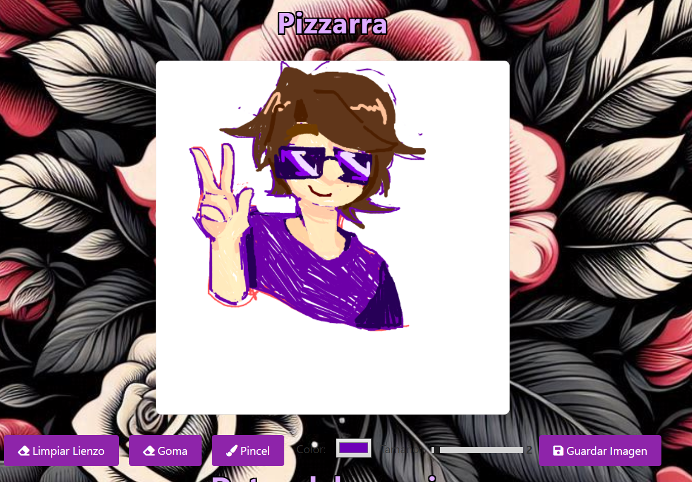

Proyecto: Aplicación de registro de usuario y pizarra de dibujo

Descripción:
Este proyecto es una aplicación web que consta de dos partes principales:

Registro de Usuario: El usuario puede ingresar sus datos personales, que luego se muestran en una tabla en la web.
Pizarra de Dibujo: Incluye una pizarra en la que el usuario puede dibujar utilizando un pincel con diferentes tamaños y colores, o bien borrar utilizando una goma de borrar. Además, permite guardar el dibujo como una imagen PNG.

Características Principales:

1. Registro de usuario
    El usuario ingresa datos como nombre, apellido, DNI, correo electrónico y fecha de nacimiento mediante ventanas emergentes (prompt).
    Se crea un objeto Usuario con la información ingresada.
    Los datos ingresados por el usuario se muestran en una tabla en la web, organizada en filas con descripciones correspondientes.

2. Pizarra de dibujo
    Tamaño y color del pincel: El usuario puede seleccionar el tamaño del pincel mediante un control de rango y elegir el color mediante un selector de color.
    Modo pincel y modo goma: Se puede cambiar entre dibujar con el pincel y borrar utilizando una goma.
    Guardar imagen: El usuario puede descargar su dibujo en formato PNG.
    Líneas más suaves: Las líneas dibujadas son redondeadas en sus bordes y esquinas para proporcionar una experiencia de dibujo fluida.
    Limpieza del lienzo: Se puede borrar todo el contenido del lienzo con un botón.

   Créditos
   
El código base de la funcionalidad de la pizarra fue adaptado de un tutorial disponible en Programador Web Valencia( https://programadorwebvalencia.com/dibujar-con-el-raton-en-HTML-y-Javascript/ ). Se han realizado modificaciones para agregar nuevas características, como el guardado de la imagen en formato PNG y la posibilidad de cambiar entre pincel y goma.

